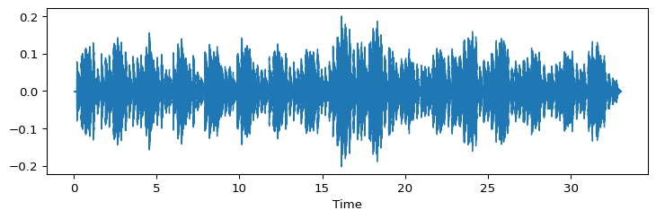
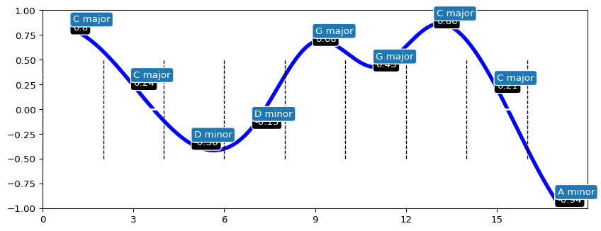

# Relative Mode


<!--conda activate relative_mode-->

This package contains Python code for calculating *relative mode* from
an audio signal. *Relative mode* refers to the degree between how major
or minor does the segment of music sound at a given time. It is based on
a classic key-finding algorithm (Krumhansl-Schmuckler, 1990) and
extracts the pitch-class information using chromagrams. The relative
mode is calculated as the difference between the strongest major key and
the strongest minor key. Relative mode can vary from -1.0 (clearly in
minor) to + 1.0 (clearly in major) and gives a value between these
extremes for the whole excerpt. Alternatively the algorithm can provide
the output for each window of analysis (segments of 3 seconds as a
default).

The algorithm and how it is evaluated is fully documented in a
paper:

Eerola, T., & Schutz, M. (2025). Major-minorness in tonal music: Evaluation of relative mode estimation using expert ratings and audio-based key-finding principles. _Psychology of Music, 0(0)_. [https://doi.org/10.1177/03057356251326065](https://doi.org/10.1177/03057356251326065)

### Libraries

``` python
import librosa.display
import matplotlib
import numpy as np
from matplotlib import pyplot as plt
import pandas as pd
```

### Load package using pip

``` python
pip install relative_mode
```

Make function calls explicit for the subsequent analyses.

``` python
from src.relative_mode import Tonal_Fragment
from src.relative_mode import relative_mode
from src.relative_mode import RME_across_time
```

### Load a music example

Recording of J.S. Bach’s *C Major Prelude* (WTC Book I) (an extract).

``` python
filename = 'data/Bach_1_Gould_0_Major_bachGould1971.wav'
y, sr = librosa.load(filename)
plt.figure(figsize=(9,2.5))
librosa.display.waveshow(y, sr = sr)
plt.show()
```



### Estimate relative mode

Here we don’t specify any parameters but just run `relative_mode`.

``` python
RM, RM_segments = relative_mode(y = y, sr = sr)
print(round(RM['tondeltamax'][0],3))
```

    0.258

The value of *0.258* could be called “moderately in major”. Value closer
to 0 would indicate no clear tendency for major or minor and any value
below -0.30 would suggest clearly in minor key.

This measure can be computed with a different options. You can alter key
profile (e.g. `krumhansl`, `albrecht` (default), `aarden`, or
`bellman`), similarity metrics (`pearson`, `cosine` (default), or
`euclidean`), chromatype from `CENS` to `CQT`. There are also some
alternative outputs of the measure.

``` python
RM2, RM2_segments = relative_mode(y = y, sr = sr, profile = 'simple', distance = 'pearson', chromatype = 'CQT')
print(RM2)
```

       tonmaxmaj  tonmaxmin  tondeltamax  tondeltamaxMd  tondeltamaxSi
    0   0.688322   0.640134     0.144563       0.176965            3.0

### Estimate relative mode across the excerpt

``` python
fig, RM3 = RME_across_time(filename = filename, winlen = 3, hoplen = 3, cropfirst = 0, croplast = 0, chromatype = 'CENS', profile = 'albrecht', distance = 'cosine', plot = True)
fig
plt.show()
```



## Alternative analyses

In the article (Eerola & Schutz, 2025), we assess various parameters of
the model (key profiles, distance measures, alternative formulations of
the model) in Experiment 1. We also examine what could explain the
variations in model success across recordings used in Experiment 3. Here
we briefly report these alternative explorations.

### Experiment 1: Alternative analyses

The model compares the difference between highest maximum major key
strength and the maximum minor key strength. We also have two
alternative formulations of the model, one that utilises comparison with
the parallel minor and another one relying on the relative minor.

The parallel minor key of the major key received lower correlation with
the expert ratings (*r* = 0.698) than the actual model (*r* = 0.840).
The second alternative relies on the relative minor key of the major
key. This alternative received a lower correlation (*r* = 0.766) with
the expert ratings compared to the proposed model. For this reason, we
did not pursue these two alternatives further.

We also run alternative formulations of window length (1 to 5 seconds)
and overlap (0 to 75% overlap) which did not provide substantially
better fit with the data. Finally, the way of summarizing the RME across
the analysis windows with the mean values did not appear to be
significantly different from the taking median of the predictions within
the analysis windows (*r* = 0.785).

### Experiment 3: Alternative analyses

To identify the consistent noise factors in the RME analysis from audio,
we extracted dynamics, several timbral descriptors (brightness, spectral
centroid, spectral flux, rms, roughness) and tempo descriptors for each
excerpt using [Essentia](https://essentia.upf.edu), and added these as
additional predictors to the regression with RME model predicting the
expert ratings. However, no single audio descriptor could contribute
significantly (more than 2 % of the variance accounted) to the model
that already had a highly successful predictor (RME) within it. A more
extensive analysis of the potential additional considerations would
benefit from a larger set of materials and from systematic alterations
of the most plausible variations of these factors.

# References

Eerola, T., & Schutz, M. (2025). Major-minorness in tonal music: Evaluation of relative mode estimation using expert ratings and audio-based key-finding principles. _Psychology of Music, 0(0)_. [https://doi.org/10.1177/03057356251326065](https://doi.org/10.1177/03057356251326065)
